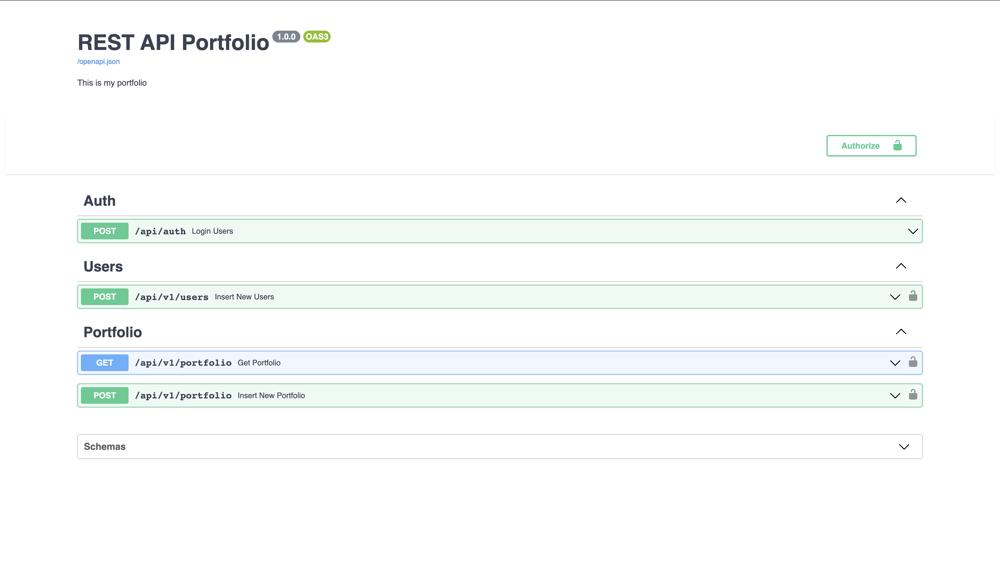
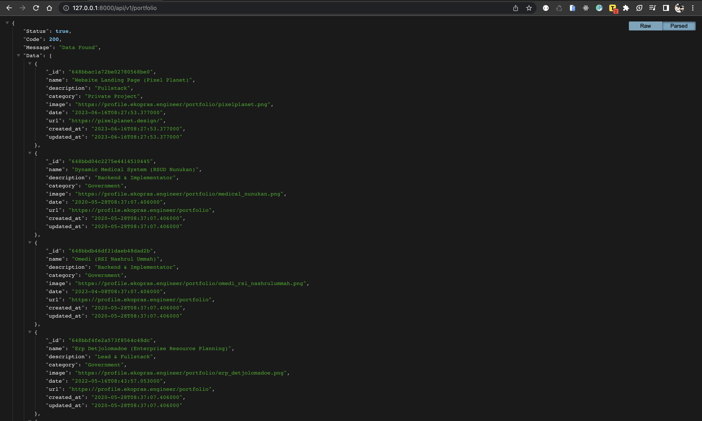

# FastAPI Learn
<!-- apikey -->
<!-- 14fe5656c4b589be5fcf5bb436f2507c2c82d4bc4ab6b763b59f087e0b95ddff -->

- Copy `.env.example` to `.env`
```bash
cp .env.example .env
```
- Get Your mongo uri from [MongoDB Atlas](https://www.mongodb.com/cloud/atlas)
- Create api key at [Handle JWT tokens](https://fastapi.tiangolo.com/tutorial/security/oauth2-jwt/#handle-jwt-tokens)
```bash
openssl rand -hex 32
```
<small>*Make sure you have `openssl` installed</small>

- Set `API_KEY` and `MONGO_URI` in `.env`
- Install Dependencies
```bash
pip install -r requirements.txt
```
- Run App
```bash
uvicorn main:app --reload
```
# Endpoints
1. Docs
- [GET] `/` - Docs
- [GET] `/redocs` - Redocs

2. Auth
- [POST] `/api/auth` - Login Auth

3. Users
- [POST] `/api/v1/users` - Create user

4. Portfolio
- [GET] `/api/v1/portfolio` - Get all portfolio
- [POST] `/api/v1/portfolio` - Create portfolio
- [GET] `/api/v1/portfolio/{id}` - Get portfolio by id (On Progress)
- [PUT] `/api/v1/portfolio/{id}` - Update portfolio by id (On Progress)
- [DELETE] `/api/v1/portfolio/{id}` - Delete portfolio by id (On Progress)

# Preview FastAPI Portfolio

[](#)
<br/>

[](#)